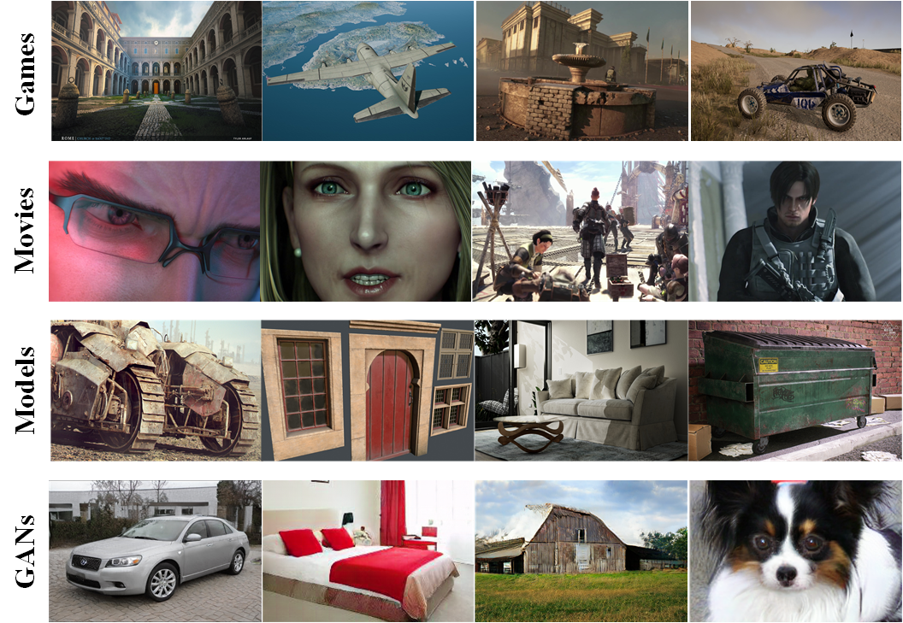

# Large-Scale CG images Benchmark (NLPR-LSCGB):

We build a Large-Scale CG images Benchmark (NLPR-LSCGB), which is orders of magnitude bigger than existing datasets. The strict collection principles guarantee a high diversity and small bias in dataset.

## Examples

#### Computer-Generated (CG) images

#### Photographic (PG) images

## Paper

#### Robust Texture-aware Computer-generated Image Forensic: Benchmark and Algorithm

Weiming Bai, Zhipeng Zhang, Bing Li, Pei Wang, Yangxi Li, Congxuan Zhang, Weiming Hu

IEEE Transactions on Image Processing (TIP), 2021

[[paper](https://ieeexplore.ieee.org/document/9559870)]

## Data

To download the dataset, please fill the [agreement form](https://docs.google.com/forms/d/e/1FAIpQLSeHbLQ-Mtzl42Yb5wIJ0IQfbW0X7HqC3nsCogFWmjAglarmNA/viewform) that indicates you agree to the [NLPR-LSCGB Terms of Use](https://drive.google.com/file/d/1NlOjRb-yMU9u6eweSelYIuqtHkGoKpzI/view?usp=sharing). After we receive your agreement form, we will provide download access to the dataset.
